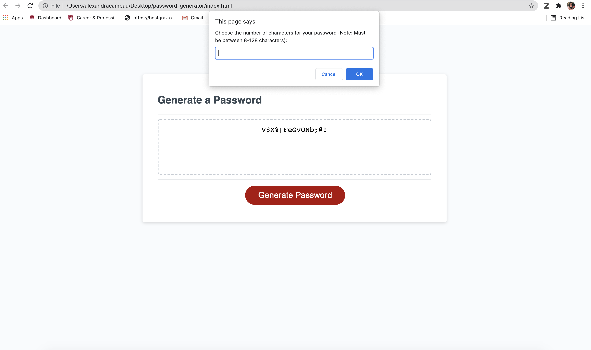

<h1> Password Generator </h1>

<h2> Description</h2>

This project required a modification to the starter code to create an application that enables employees to generate random passwords based on criteria that they’ve selected. The applicaiton includes the following:  
    <ul>
   <li>Runs in the browser and will feature dynamically updated HTML and CSS powered by JavaScript code</li>
   <li>Has a clean and polished, responsive user interface that adapts to multiple screen sizes </li>
    </ul>
    

<h2>User Story</h2>

AS AN employee

I WANT to randomly generate a password that meets certain criteria

SO THAT I can create a strong password that provides greater security

<h2>Acceptance Criteria</h2>

GIVEN I need a new, secure password

WHEN I click the button to generate a password

THEN I am presented with a series of prompts for password criteria

WHEN prompted for password criteria

THEN I select which criteria to include in the password

WHEN prompted for the length of the password

THEN I choose a length of at least 8 characters and no more than 128 characters

WHEN asked for character types to include in the password

TTHEN I confirm whether or not to include lowercase, uppercase, numeric, and/or special characters

WHEN I answer each prompt

THEN my input should be validated and at least one character type should be selected

WHEN all prompts are answered

THEN a password is generated that matches the selected criteria

WHEN the password is generated

THEN the password is either displayed in an alert or written to the page

<h2>Deployed Page</h2>

Page published at: https://acampau.github.io/password-generator/

<h2>Screenshot</h2>

